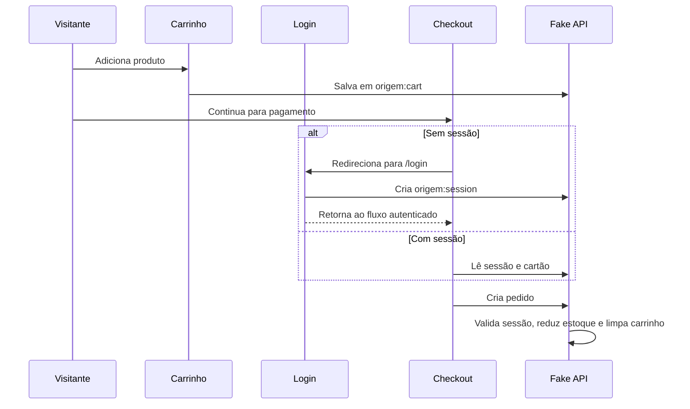

# Fake API do artpop

## 1. Objetivo

A Fake API permite que o frontend funcione antes da implementação do backend. Ela mantém contratos de dados e funções organizadas por domínio, mas usa `localStorage`, dados mockados e cálculos locais em vez de endpoints HTTP.

A implementação está em `frontend/src/services/api/`.

> Esta camada é adequada para prototipação e demonstração local. Não deve ser usada para armazenar dados reais de usuários, pagamentos ou pedidos em produção.

## 2. Princípios atuais

- Os componentes consomem services, não acessam diretamente os mocks de produtos quando existe um service equivalente.
- O catálogo inicial combina `demoProducts` com produtos publicados no navegador.
- Os dados persistidos pertencem ao navegador e não são compartilhados entre usuários ou dispositivos.
- Eventos customizados, como `cart-updated` e `auth-updated`, atualizam componentes que dependem de carrinho ou sessão.
- A autenticação de checkout é validada tanto na interface quanto em `createOrder`.

## 3. Persistência local

| Chave | Service | Conteúdo |
| --- | --- | --- |
| `origem:products` | `produtos.service.ts` | Produtos publicados ou alterações locais de estoque |
| `origem:cart` | `carrinho.service.ts` | Itens do carrinho |
| `origem:shipping-selection` | `carrinho.service.ts` | Opção de frete selecionada |
| `origem:artisan-profile` | `usuarios.service.ts` | Perfil local do artesão |
| `origem:favorites` | `favoritos.service.ts` | IDs das obras aplaudidas |
| `origem:accounts` | `auth.service.ts` | Contas da Fake API |
| `origem:session` | `auth.service.ts` | Sessão atual do usuário |
| `origem:login-attempts` | `auth.service.ts` | Contagem e bloqueio temporário de tentativas |
| `origem:payment-profile` | `pedidos.service.ts` | Token, bandeira e últimos dígitos do cartão |
| `origem:orders` | `pedidos.service.ts` | Pedidos criados localmente |

## 4. Domínios e contratos

### 4.1 Produtos e catálogo

Service: `produtos.service.ts`

Operações atuais:

- `readProducts()` lê produtos publicados localmente.
- `readCatalogProducts()` combina mocks e produtos locais, evitando duplicação por ID.
- `createProduct(draft)` cria uma obra com `crypto.randomUUID()`.
- `updateProduct(productId, updates)` atualiza uma obra.
- `updateProductStock(productId, stock)` atualiza estoque.

Contrato resumido:

```ts
interface Product {
  id: string;
  title: string;
  category: 'ceramica' | 'madeira' | 'textil' | 'joalheria' | 'outros' | '';
  technique: string;
  price: number;
  stock: number;
  description: string;
  mainImage: string;
  additionalImages: string[];
  createdAt: string;
  artisanCity: string;
  artisanName?: string;
  artisanBio?: string;
}
```

Produtos mockados sem imagem recebem uma imagem de catálogo no frontend. No backend, as imagens devem ser armazenadas em um serviço de objetos ou CDN, e o banco deve guardar apenas as URLs e metadados.

### 4.2 Artesãos e recomendações

Services:

- `artesoes.service.ts`
- `recomendacoes.services.ts`

Operações atuais:

- `readArtisans()` agrupa produtos por artesão ou município.
- `readArtisanById(id)` consulta o perfil público e suas obras.
- `readRelatedProducts(product, limit)` retorna produtos relacionados por categoria e técnica.

O perfil atual é derivado de mocks, produtos e perfil local. No backend real, artesão e produto devem possuir relacionamentos persistidos por IDs, sem depender do nome ou município.

### 4.3 Autenticação

Service: `auth.service.ts`

Operações atuais:

- `register(name, email, password, phone, cpf, role)` valida e cria uma conta.
- `login(email, password)` valida credenciais e cria uma sessão.
- `getCurrentUser()` lê a sessão atual.
- `logout()` remove a sessão e limpa dados temporários de compra.

Papéis disponíveis:

```ts
type UserRole = 'buyer' | 'artisan' | 'admin';
```

Medidas presentes no protótipo:

- Hash SHA-256 da senha usando Web Crypto.
- Validação de CPF e telefone.
- CPF armazenado como hash e últimos quatro dígitos.
- Telefone armazenado mascarado.
- Sessão com validade de oito horas.
- Bloqueio local após cinco tentativas inválidas por um minuto.

Essas medidas não substituem autenticação de servidor. O hash da Fake API pode ser inspecionado pelo usuário do navegador e o `localStorage` pode ser alterado manualmente.

### 4.4 Carrinho e frete

Service: `carrinho.service.ts`

Operações atuais:

- `readCart()`
- `addToCart(product, quantity)`
- `updateCartItemQuantity(productId, quantity)`
- `removeFromCart(productId)`
- `clearCart()`
- `calculateShipping(postalCode)`
- `saveShippingSelection(option)`
- `readShippingSelection()`

O visitante pode navegar e montar o carrinho sem login. A autenticação só é exigida ao entrar no checkout ou finalizar a compra.

A cotação de frete é simulada com base nos dois primeiros dígitos do CEP e retorna PAC e Sedex. No backend real, o cálculo deve consultar uma transportadora ou regra de frete configurada no servidor.

### 4.5 Pedidos e pagamentos

Service: `pedidos.service.ts`

Contrato resumido:

```ts
interface Order {
  id: string;
  createdAt: string;
  items: CartItem[];
  total: number;
  shipping?: {
    name: string;
    price: number;
    deliveryTime: string;
  };
  status: 'Pendente' | 'Enviado' | 'Concluído' | 'Cancelado';
  payment: {
    brand: 'Visa' | 'Mastercard' | 'Elo' | 'Cartão' | 'Pix';
    last4: string;
  };
}
```

Operações atuais:

- `readOrders()`
- `createOrder(payment)`
- `cancelOrder(orderId)`
- `tokenizeCard(details)`
- `readPaymentProfile()`
- `savePaymentProfile(profile)`

Métodos de pagamento disponíveis no checkout:

- Pix: chave local de demonstração e QR Code gerado por serviço externo.
- Cartão de crédito: tokenização simulada e validação de Luhn.
- Cartão de débito: usa o mesmo fluxo simulado de cartão.
- Cupons: `cupons.service.ts` mantém cinco códigos fictícios e calcula desconto percentual no carrinho.

`createOrder` recusa a operação se não houver sessão autenticada ou itens no carrinho. Ao criar o pedido, o estoque local é reduzido e o carrinho é limpo.

### 4.6 Favoritos e aplausos

Service: `favoritos.service.ts`

- `readFavoriteIds()` retorna IDs aplaudidos.
- `isFavorite(productId)` verifica um ID.
- `toggleFavorite(productId)` adiciona ou remove o aplauso.

A lista é atualmente anônima e local. No backend, favoritos devem estar associados ao usuário autenticado.

### 4.7 Administração

Service: `admin.service.ts`

- `readAdminSnapshot()` reúne produtos, pedidos e artesãos.
- `updateOrderStatus(orderId, status)` atualiza o status de um pedido.

No protótipo, não existe autorização real. A rota administrativa deve ser protegida por papel de usuário no backend futuro.

## 5. Fluxo de compra atual



## 6. Substituição pelo backend real

A substituição deve preservar os contratos usados pelos componentes. A recomendação é manter os mesmos nomes de funções nos services e trocar apenas a implementação interna de `localStorage` por chamadas HTTP.

### 6.1 Cliente HTTP

Implementar `frontend/src/services/api/client.ts`:

```ts
const API_URL = process.env.NEXT_PUBLIC_API_URL!;

export async function apiFetch<T>(path: string, init?: RequestInit): Promise<T> {
  const response = await fetch(`${API_URL}${path}`, {
    ...init,
    headers: { 'Content-Type': 'application/json', ...init?.headers },
    credentials: 'include',
  });
  if (!response.ok) throw new Error(await response.text());
  return response.json() as Promise<T>;
}
```

O frontend deve continuar chamando, por exemplo, `readCatalogProducts()`, enquanto o service passa a chamar `GET /products`.

### 6.2 Mapeamento recomendado de endpoints

| Função atual | Endpoint futuro | Acesso |
| --- | --- | --- |
| `readCatalogProducts` | `GET /api/products` | Público |
| `createProduct` | `POST /api/products` | Artesão autenticado |
| `updateProduct` | `PATCH /api/products/:id` | Dono ou admin |
| `updateProductStock` | `PATCH /api/products/:id/stock` | Dono ou admin |
| `readArtisans` | `GET /api/artisans` | Público |
| `readArtisanById` | `GET /api/artisans/:id` | Público |
| `readRelatedProducts` | `GET /api/products/:id/related` | Público |
| `register` | `POST /api/auth/register` | Público |
| `login` | `POST /api/auth/login` | Público |
| `getCurrentUser` | `GET /api/auth/me` | Autenticado |
| `logout` | `POST /api/auth/logout` | Autenticado |
| `readCart` | `GET /api/cart` | Autenticado ou sessão anônima |
| `addToCart` | `POST /api/cart/items` | Autenticado ou sessão anônima |
| `updateCartItemQuantity` | `PATCH /api/cart/items/:id` | Dono do carrinho |
| `removeFromCart` | `DELETE /api/cart/items/:id` | Dono do carrinho |
| `calculateShipping` | `POST /api/shipping/quote` | Público ou checkout |
| `createOrder` | `POST /api/orders` | Autenticado |
| `readOrders` | `GET /api/orders` | Comprador ou admin |
| `cancelOrder` | `POST /api/orders/:id/cancel` | Comprador autorizado |
| `updateOrderStatus` | `PATCH /api/orders/:id/status` | Artesão ou admin |
| `tokenizeCard` | Gateway de pagamento no servidor | Nunca expor segredo no frontend |
| Pix | `POST /api/payments/pix` | Autenticado |
| Favoritos | `GET/PUT /api/favorites` | Autenticado |
| `readAdminSnapshot` | `GET /api/admin/overview` | Admin |

### 6.3 Autenticação e autorização reais

1. Criar usuários no banco com senha usando Argon2id ou bcrypt, nunca SHA-256 simples.
2. Usar cookie de sessão `HttpOnly`, `Secure` e `SameSite` ou tokens de curta duração com rotação.
3. Validar o usuário no servidor em todas as operações privadas.
4. Aplicar autorização por papel e propriedade do recurso.
5. Implementar recuperação de senha, revogação de sessão e MFA quando necessário.
6. Aplicar rate limiting no login e nos endpoints sensíveis.

### 6.4 Pedidos e estoque

A criação do pedido deve ser uma transação no banco:

1. Validar sessão e itens.
2. Reconsultar preços e estoque no servidor.
3. Reservar ou baixar estoque atomicamente.
4. Calcular frete e total no servidor.
5. Criar o pedido e seus itens.
6. Criar a cobrança no gateway.
7. Confirmar o pedido por webhook do provedor de pagamento.
8. Liberar ou devolver estoque em cancelamentos e falhas.

O frontend nunca deve enviar o total como fonte confiável.

### 6.5 Dados pessoais e LGPD

- CPF deve ser criptografado ou protegido conforme a necessidade de negócio.
- Dados de pagamento não devem ser armazenados pela aplicação; usar token do gateway.
- Separar dados públicos do perfil dos dados privados da conta.
- Implementar consentimento, finalidade, retenção, exportação, correção e exclusão.
- Registrar auditoria de acesso a dados sensíveis.
- Configurar backups, controle de acesso e política de retenção.

### 6.6 Migração incremental

1. Criar os endpoints e manter a Fake API funcionando por uma flag de configuração.
2. Implementar `client.ts` e testes de contrato.
3. Migrar primeiro catálogo, artesãos e recomendações.
4. Migrar autenticação e sessão.
5. Migrar carrinho e frete.
6. Migrar pedidos, estoque e pagamentos.
7. Migrar favoritos e administração.
8. Remover `localStorage` de dados de negócio após validar todos os fluxos.
9. Manter apenas cache local não sensível, se necessário.

Durante a transição, os componentes não devem ser alterados para conhecer detalhes de HTTP. Essa responsabilidade permanece nos services.

## 7. Limitações conhecidas

- Não há endpoints HTTP no backend atual.
- `localStorage` não oferece isolamento, criptografia ou sincronização entre dispositivos.
- O QR Code Pix depende de um serviço externo no protótipo.
- Os cupons ainda são locais e fictícios; a validação definitiva deverá ocorrer no backend.
- Não há gateway de pagamento real.
- Não há garantia de concorrência ou reserva de estoque entre usuários.
- A Fake API não substitui controles de segurança, LGPD e auditoria de produção.
